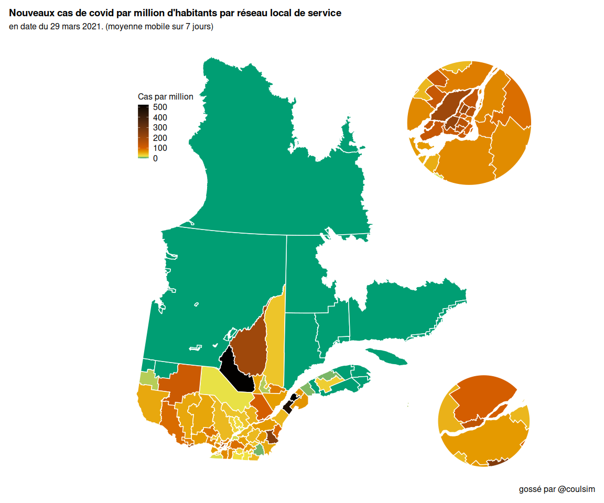
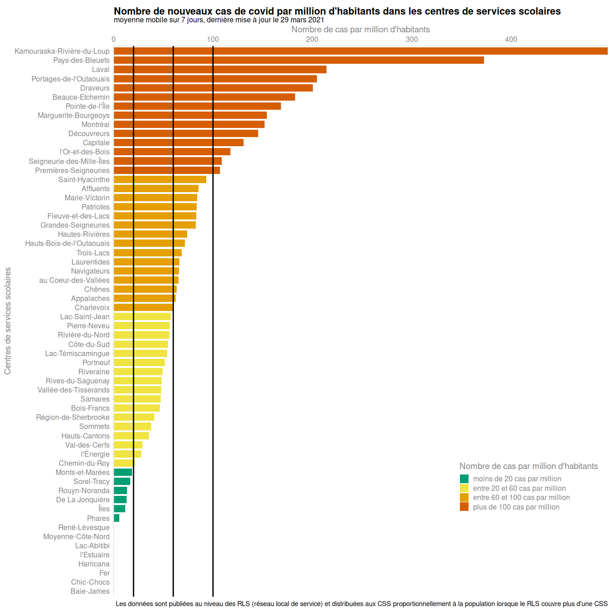
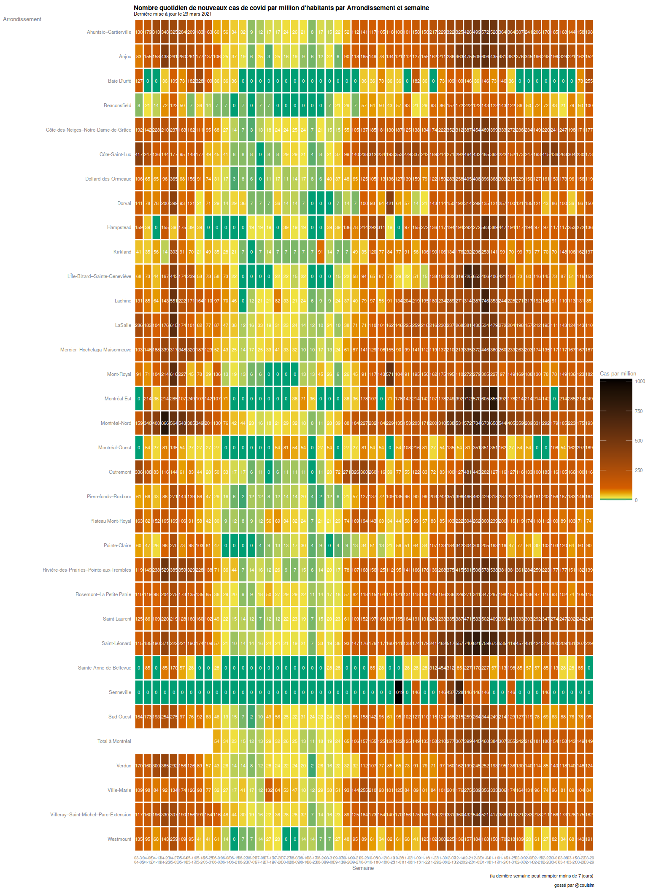

<!-- README.md is generated from README.Rmd. Please edit that file -->

# covidtwitterbot

<!-- badges: start -->

<!-- badges: end -->

The goal of covidtwitterbot is to generate the figures and maps that are
posted on my twitter bot, @covid\_coulsim.

## Installation

You can install the development version from
[GitHub](https://github.com/) with:

``` r
# install.packages("devtools")
devtools::install_github("SimonCoulombe/covidtwitterbot")
```

Pour les utilisateurs linux, vous aurez probablement besoin d’installer
des librairies tels que

geos-devel  
sqlite3-devel  
proj-devel  
gdal-devel  
libopenssl-devel

## Example

### Tables

Here are the tables you can fetch and the graphics you can generate..
They are generated from the most up-to-date data.

``` r
library(ggplot2)
library(patchwork)
library(covidtwitterbot)
library(knitr)
```

#### get\_inspq\_covid19\_hist()

The `get_inspq_covid19_hist()` function fetches historical data for
Quebec by age, health region and gender. This includes the numbers of
cases (“cas\_*"), of deaths ("dec\_*”) of hospitalizations (“hos\_*")
and persons tested ("psi\_*”).

**dictionnaire (partiel)des données: **

cas\_cum\_tot\_n = nombre de cas confirmés (cumulatifs) selon date de
déclaration  
cas\_cum\_lab\_n = nombre de cas confirmés en laboratoire (cumulatif)
selon date de déclaration  
cas\_cum\_epi\_n = nombre de cas confirmés par lien épidémiologique
(cumulatif) selon date de déclaration  
cas\_quo\_tot\_n = nombre de cas confirmés (quotidien) selon date de
déclaration  
cas\_quo\_lab\_n = nombre de cas confirmés en laboratoire (quotidien)
selon date de déclaration  
cas\_quo\_epi\_n = nombre de cas confirmés par lien épidémiologique
(quotidien) selon date de déclaration

act\_cum\_tot\_n = nombre de cas actifs (aujourd’hui)

ret\_cum\_tot\_n = nombre de cas rétablis (cumulatifs  
ret\_quo\_tot\_n = nombre de cas rétablis (quotidien)

dec\_cum\_tot\_n = total des décès (cumulatif)  
dec\_cum\_chs\_n = total des décès en CHSLD (cumulatif)  
dec\_cum\_rpa\_n = total des décès en RPA (cumulatif)  
dec\_cum\_dom\_n = total des décès à domicile et inconnu (cumulatif)  
dec\_cum\_aut\_n = total des décès en RI et autre (cumulatif)  
dec\_quo\_tot\_n = total des décès (quotidien)  
dec\_quo\_chs\_n = total des décès en CHSLD (quotidien)  
dec\_quo\_rpa\_n = total des décès en RPA (quotidien)  
dec\_quo\_dom\_n = total des décès à domicile et inconnu (quotidien)  
dec\_quo\_aut\_n = total des décès en RI et autre (quotidien)

ATTENTION: EN DATE DU 18 novembre 2020 LES HOSPITALISATIONS NE SONT PAS
AUGMENTÉES ENTRE LE DERNIER JOUR ET L’AVANT DERNIER JOUR Date Nom
hos\_cum\_reg\_n hos\_cum\_si\_n hos\_cum\_tot\_n hos\_cum\_tot\_t
hos\_quo\_tot\_t hos\_quo\_reg\_n hos\_quo\_si\_n hos\_quo\_tot\_n
hos\_quo\_tot\_m <chr> <chr> <dbl> <dbl> <dbl> <dbl> <dbl> <dbl> <dbl>
<dbl> <dbl> 1 2020-11-17 Ensemble du Québec 8846 1847 10693 125. 0.37 30
2 32 NA 2 2020-11-18 Ensemble du Québec 8846 1847 10693 125. 0 0 0 0 NA

hos\_quo\_tot\_n = nouvelles hospitalisations (régulières + soins
intensifs)  
hos\_quo\_reg\_n = nouvelles hospitalisations hors soins intensifs  
hos\_quo\_si\_n = nouvelles hospitalisations aux soins intensifs

# ATENTION : EN DATE DU 18 novembre 2020 les PSI quotidiens sont à 0 pour la dernière journée .. sur le site ils utilisent le cumulatif du 18 novembre 2079892 et le quotidien du 17 novembre 28121

A tibble: 2 x 9 Date Nom psi\_cum\_tes\_n psi\_cum\_pos\_n
psi\_cum\_inf\_n psi\_quo\_pos\_n psi\_quo\_inf\_n psi\_quo\_tes\_n
psi\_quo\_pos\_t <chr> <chr> <dbl> <dbl> <dbl> <dbl> <dbl> <dbl> <dbl> 1
2020-11-17 Ensemble du Québec 2074847 119933 1954914 1246 26875 28121
4.44 2 2020-11-18 Ensemble du Québec 2079892 120548 1959344 0 0 0 NA

psi\_cum\_test\_pos = cas confirmés cumulatif  
psi\_cum\_test\_inf = personnes infirmées (test négatifs) cumulatif  
psi\_cum\_test\_n = cumul de personnes testées cumulatif  
psi\_quo\_test\_pos = cas confirmés quotidien \#\# ATTENTION cet colonne
est vide pour la dernière journée  
psi\_quo\_test\_inf = personnes infirmées (test négatifs) quotidien \#\#
ATTENTION cet colonne est vide pour la dernière journée  
psi\_quo\_test\_n = cumul de personnes testées quotidien \#\# ATTENTION
cet colonne est vide pour la dernière journée

``` r
get_inspq_covid19_hist() %>% tail(20)  %>%  knitr::kable()
```

| Date       | Regroupement     | Croisement | Nom                  | cas\_cum\_lab\_n | cas\_cum\_epi\_n | cas\_cum\_tot\_n | cas\_cum\_tot\_t | cas\_quo\_tot\_t | cas\_quo\_lab\_n | cas\_quo\_epi\_n | cas\_quo\_tot\_n | act\_cum\_tot\_n | act\_cum\_tot\_t | cas\_quo\_tot\_m | cas\_quo\_tot\_tm | ret\_cum\_tot\_n | ret\_quo\_tot\_n | dec\_cum\_tot\_n | dec\_cum\_tot\_t | dec\_quo\_tot\_t | dec\_cum\_chs\_n | dec\_cum\_rpa\_n | dec\_cum\_dom\_n | dec\_cum\_aut\_n | dec\_quo\_tot\_n | dec\_quo\_chs\_n | dec\_quo\_rpa\_n | dec\_quo\_dom\_n | dec\_quo\_aut\_n | dec\_quo\_tot\_m | dec\_quo\_tot\_tm | hos\_cum\_reg\_n | hos\_cum\_si\_n | hos\_cum\_tot\_n | hos\_cum\_tot\_t | hos\_quo\_tot\_t | hos\_quo\_reg\_n | hos\_quo\_si\_n | hos\_quo\_tot\_n | hos\_quo\_tot\_m | psi\_cum\_tes\_n | psi\_cum\_pos\_n | psi\_cum\_inf\_n | psi\_quo\_pos\_n | psi\_quo\_inf\_n | psi\_quo\_tes\_n | psi\_quo\_pos\_t | date       | type             | groupe               | cas\_totaux\_cumul | cas\_totaux\_quotidien | deces\_totaux\_quotidien |     pop |
| :--------- | :--------------- | :--------- | :------------------- | ---------------: | ---------------: | ---------------: | ---------------: | ---------------: | ---------------: | ---------------: | ---------------: | ---------------: | ---------------: | ---------------: | ----------------: | ---------------: | ---------------: | ---------------: | ---------------: | ---------------: | ---------------: | ---------------: | ---------------: | ---------------: | ---------------: | ---------------: | ---------------: | ---------------: | ---------------: | ---------------: | ----------------: | ---------------: | --------------: | ---------------: | ---------------: | ---------------: | ---------------: | --------------: | ---------------: | ---------------: | ---------------: | ---------------: | ---------------: | ---------------: | ---------------: | ---------------: | ---------------: | :--------- | :--------------- | :------------------- | -----------------: | ---------------------: | -----------------------: | ------: |
| 2020-12-07 | Groupe de région | REG02      | Ceinture de Montréal |            26273 |             1737 |            28010 |          1900.84 |            11.13 |              161 |                3 |              164 |             2218 |           150.52 |               NA |                NA |            24415 |              217 |             1107 |            75.12 |             0.00 |              635 |              232 |              171 |               69 |                0 |                0 |                0 |                0 |                0 |               NA |                NA |               NA |              NA |               NA |               NA |               NA |               NA |              NA |               NA |               NA |           405111 |            25983 |           379128 |               NA |               NA |               NA |               NA | 2020-12-07 | region\_montreal | Ceinture de Montréal |              28010 |                    164 |                        0 |      NA |
| 2020-12-07 | Groupe de région | REG03      | Autres régions       |            56898 |             2414 |            59312 |          1301.53 |             9.70 |              429 |               13 |              442 |             7106 |           155.93 |               NA |                NA |            49547 |              624 |             1744 |            38.27 |             0.22 |              761 |              485 |              391 |              107 |               10 |                6 |                0 |                4 |                0 |               NA |                NA |               NA |              NA |               NA |               NA |               NA |               NA |              NA |               NA |               NA |          1102775 |            56221 |          1046554 |               NA |               NA |               NA |               NA | 2020-12-07 | region\_montreal | Autres régions       |              59312 |                    442 |                       10 |      NA |
| 2020-12-07 | Groupe de région | REG00      | Inconnu              |                3 |                0 |                3 |               NA |               NA |                0 |                0 |                0 |                0 |               NA |               NA |                NA |                3 |                0 |                0 |               NA |               NA |                0 |                0 |                0 |                0 |                0 |                0 |                0 |                0 |                0 |               NA |                NA |               NA |              NA |               NA |               NA |               NA |               NA |              NA |               NA |               NA |             5855 |              171 |             5684 |               NA |               NA |               NA |               NA | 2020-12-07 | region\_montreal | Inconnue             |                  3 |                      0 |                        0 |      NA |
| 2020-12-07 | Groupe de région | REG98      | Hors Québec          |              125 |                2 |              127 |               NA |               NA |                0 |                0 |                0 |               11 |               NA |               NA |                NA |              115 |                5 |                0 |               NA |               NA |                0 |                0 |                0 |                0 |                0 |                0 |                0 |                0 |                0 |               NA |                NA |               NA |              NA |               NA |               NA |               NA |               NA |              NA |               NA |               NA |             5619 |              250 |             5369 |               NA |               NA |               NA |               NA | 2020-12-07 | region\_montreal | Hors Québec          |                127 |                      0 |                        0 |      NA |
| 2020-12-07 | Groupe d’âge     | 0\_9       | 0-9 ans              |             7439 |             1494 |             8933 |           999.24 |            13.31 |              112 |                7 |              119 |             1168 |           130.65 |               NA |                NA |             7665 |              101 |                0 |             0.00 |             0.00 |                0 |                0 |                0 |                0 |                0 |                0 |                0 |                0 |                0 |               NA |                NA |               NA |              NA |               NA |               NA |               NA |               NA |              NA |               NA |               NA |           226986 |             6144 |           220842 |               NA |               NA |               NA |               NA | 2020-12-07 | groupe\_age      | 0 à 9 ans            |               8933 |                    119 |                        0 |  893977 |
| 2020-12-07 | Groupe d’âge     | 10\_19     | 10-19 ans            |            15518 |             1269 |            16787 |          1911.20 |            17.42 |              149 |                4 |              153 |             1656 |           188.54 |               NA |                NA |            14964 |              172 |                1 |             0.11 |             0.00 |                0 |                0 |                1 |                0 |                0 |                0 |                0 |                0 |                0 |               NA |                NA |               NA |              NA |               NA |               NA |               NA |               NA |              NA |               NA |               NA |           238525 |            13432 |           225093 |               NA |               NA |               NA |               NA | 2020-12-07 | groupe\_age      | 10 à 19 ans          |              16787 |                    153 |                        0 |  878347 |
| 2020-12-07 | Groupe d’âge     | 20\_29     | 20-29 ans            |            22736 |             1278 |            24014 |          2273.54 |            15.43 |              162 |                1 |              163 |             1928 |           182.53 |               NA |                NA |            21832 |              208 |                3 |             0.28 |             0.00 |                0 |                0 |                3 |                0 |                0 |                0 |                0 |                0 |                0 |               NA |                NA |               NA |              NA |               NA |               NA |               NA |               NA |              NA |               NA |               NA |           289387 |            20316 |           269071 |               NA |               NA |               NA |               NA | 2020-12-07 | groupe\_age      | 20 à 29 ans          |              24014 |                    163 |                        0 | 1056242 |
| 2020-12-07 | Groupe d’âge     | 30\_39     | 30-39 ans            |            20139 |             1010 |            21149 |          1895.23 |            15.59 |              169 |                5 |              174 |             1851 |           165.87 |               NA |                NA |            19043 |              200 |                8 |             0.72 |             0.00 |                2 |                0 |                5 |                1 |                0 |                0 |                0 |                0 |                0 |               NA |                NA |               NA |              NA |               NA |               NA |               NA |               NA |              NA |               NA |               NA |           305288 |            17950 |           287338 |               NA |               NA |               NA |               NA | 2020-12-07 | groupe\_age      | 30 à 39 ans          |              21149 |                    174 |                        0 | 1115906 |
| 2020-12-07 | Groupe d’âge     | 40\_49     | 40-49 ans            |            21741 |             1028 |            22769 |          2068.34 |            16.53 |              179 |                3 |              182 |             1969 |           178.86 |               NA |                NA |            20531 |              191 |               28 |             2.54 |             0.00 |               12 |                2 |               13 |                1 |                0 |                0 |                0 |                0 |                0 |               NA |                NA |               NA |              NA |               NA |               NA |               NA |               NA |              NA |               NA |               NA |           279906 |            19612 |           260294 |               NA |               NA |               NA |               NA | 2020-12-07 | groupe\_age      | 40 à 49 ans          |              22769 |                    182 |                        0 | 1100826 |
| 2020-12-07 | Groupe d’âge     | 50\_59     | 50-59 ans            |            19466 |              891 |            20357 |          1722.18 |            11.67 |              138 |                0 |              138 |             1695 |           143.39 |               NA |                NA |            18312 |              182 |              134 |            11.34 |             0.00 |               68 |                1 |               58 |                7 |                0 |                0 |                0 |                0 |                0 |               NA |                NA |               NA |              NA |               NA |               NA |               NA |               NA |              NA |               NA |               NA |           243806 |            17742 |           226064 |               NA |               NA |               NA |               NA | 2020-12-07 | groupe\_age      | 50 à 59 ans          |              20357 |                    138 |                        0 | 1182044 |
| 2020-12-07 | Groupe d’âge     | 60\_69     | 60-69 ans            |            12202 |              477 |            12679 |          1104.76 |             6.27 |               70 |                2 |               72 |             1136 |            98.98 |               NA |                NA |            10968 |              103 |              430 |            37.47 |             0.09 |              246 |               27 |              131 |               26 |                1 |                0 |                0 |                1 |                0 |               NA |                NA |               NA |              NA |               NA |               NA |               NA |               NA |              NA |               NA |               NA |           200329 |            11318 |           189011 |               NA |               NA |               NA |               NA | 2020-12-07 | groupe\_age      | 60 à 69 ans          |              12679 |                     72 |                        1 | 1147664 |
| 2020-12-07 | Groupe d’âge     | 70\_79     | 70-79 ans            |             9051 |              200 |             9251 |          1227.41 |             7.56 |               57 |                0 |               57 |              840 |           111.45 |               NA |                NA |             6946 |               54 |             1348 |           178.85 |             0.13 |              789 |              153 |              329 |               77 |                1 |                1 |                0 |                0 |                0 |               NA |                NA |               NA |              NA |               NA |               NA |               NA |               NA |              NA |               NA |               NA |           138498 |             8138 |           130360 |               NA |               NA |               NA |               NA | 2020-12-07 | groupe\_age      | 70 à 79 ans          |               9251 |                     57 |                        1 |  753700 |
| 2020-12-07 | Groupe d’âge     | 80\_89     | 80-89 ans            |            11111 |              254 |            11365 |          3468.38 |            21.36 |               69 |                1 |               70 |             1636 |           499.28 |               NA |                NA |             6580 |               59 |             2895 |           883.50 |             1.53 |             1826 |              588 |              338 |              143 |                5 |                2 |                0 |                3 |                0 |               NA |                NA |               NA |              NA |               NA |               NA |               NA |               NA |              NA |               NA |               NA |            89885 |             9916 |            79969 |               NA |               NA |               NA |               NA | 2020-12-07 | groupe\_age      | 80 à 89 ans          |              11365 |                     70 |                        5 |  327675 |
| 2020-12-07 | Groupe d’âge     | 90\_       | 90 ans et plus       |             7148 |              217 |             7365 |          8908.91 |            39.92 |               33 |                0 |               33 |              973 |          1176.97 |               NA |                NA |             3920 |               23 |             2404 |          2907.95 |             6.05 |             1617 |              536 |              131 |              120 |                5 |                4 |                0 |                1 |                0 |               NA |                NA |               NA |              NA |               NA |               NA |               NA |               NA |              NA |               NA |               NA |            39512 |             7157 |            32355 |               NA |               NA |               NA |               NA | 2020-12-07 | groupe\_age      | 90 ans et +          |               7365 |                     33 |                        5 |   82670 |
| 2020-12-07 | Groupe d’âge     | INC        | Inconnu              |               34 |               34 |               68 |               NA |               NA |                0 |                0 |                0 |                1 |               NA |               NA |                NA |               66 |                0 |                0 |               NA |               NA |                0 |                0 |                0 |                0 |                0 |                0 |                0 |                0 |                0 |               NA |                NA |               NA |              NA |               NA |               NA |               NA |               NA |              NA |               NA |               NA |           218085 |            14572 |           203513 |               NA |               NA |               NA |               NA | 2020-12-07 | groupe\_age      | Âge inconnu          |                 68 |                      0 |                        0 |      NA |
| 2020-12-07 | Groupe d’âge     | TOT        | Total                |           146585 |             8152 |           154737 |          1812.11 |            13.60 |             1138 |               23 |             1161 |            14853 |           173.94 |               NA |                NA |           130827 |             1293 |             7251 |            84.92 |             0.14 |             4560 |             1307 |             1009 |              375 |               12 |                7 |                0 |                5 |                0 |               NA |                NA |               NA |              NA |               NA |               NA |               NA |               NA |              NA |               NA |               NA |          2270207 |           146297 |          2123910 |               NA |               NA |               NA |               NA | 2020-12-07 | groupe\_age      | Total                |             154737 |                   1161 |                       12 | 8390499 |
| 2020-12-07 | Sexe             | MASC       | Masculin             |            66023 |             4125 |            70148 |          1643.88 |            12.56 |              526 |               10 |              536 |             6736 |           157.85 |               NA |                NA |            59274 |              609 |             3331 |            78.06 |             0.12 |             1968 |              583 |              595 |              185 |                5 |                3 |                0 |                2 |                0 |               NA |                NA |               NA |              NA |               NA |               NA |               NA |               NA |              NA |               NA |               NA |          1014635 |            65619 |           949016 |               NA |               NA |               NA |               NA | 2020-12-07 | sexe             | Masculin             |              70148 |                    536 |                        5 |      NA |
| 2020-12-07 | Sexe             | FEM        | Féminin              |            80452 |             4026 |            84478 |          1977.55 |            14.61 |              611 |               13 |              624 |             8114 |           189.94 |               NA |                NA |            71446 |              684 |             3919 |            91.74 |             0.16 |             2592 |              723 |              414 |              190 |                7 |                4 |                0 |                3 |                0 |               NA |                NA |               NA |              NA |               NA |               NA |               NA |               NA |              NA |               NA |               NA |          1250446 |            80360 |          1170086 |               NA |               NA |               NA |               NA | 2020-12-07 | sexe             | Féminin              |              84478 |                    624 |                        7 |      NA |
| 2020-12-07 | Sexe             | INC        | Inconnu              |              110 |                1 |              111 |               NA |               NA |                1 |                0 |                1 |                3 |               NA |               NA |                NA |              107 |                0 |                1 |               NA |               NA |                0 |                1 |                0 |                0 |                0 |                0 |                0 |                0 |                0 |               NA |                NA |               NA |              NA |               NA |               NA |               NA |               NA |              NA |               NA |               NA |             5126 |              318 |             4808 |               NA |               NA |               NA |               NA | 2020-12-07 | sexe             | Sexe inconnu         |                111 |                      1 |                        0 |      NA |
| 2020-12-07 | Sexe             | TOT        | Total                |           146585 |             8152 |           154737 |          1812.11 |            13.60 |             1138 |               23 |             1161 |            14853 |           173.94 |               NA |                NA |           130827 |             1293 |             7251 |            84.92 |             0.14 |             4560 |             1307 |             1009 |              375 |               12 |                7 |                0 |                5 |                0 |               NA |                NA |               NA |              NA |               NA |               NA |               NA |               NA |              NA |               NA |               NA |          2270207 |           146297 |          2123910 |               NA |               NA |               NA |               NA | 2020-12-07 | sexe             | Total                |             154737 |                   1161 |                       12 |      NA |

#### get\_inspq\_manual\_data\_hospits()

The get\_inspq\_manual\_data\_hospits() function returns the historical
number of hospitalisation (hospits\_ancien and hospits), intensive care
(si) and number of tests (volumetrie) for the province

*dictionnaire des données *  
hospits = hospitalisation hors intensif en cours  
hospits\_ancien = hospitalisation hors intensif en cours (ancienne
mesure, remplacée au printemps 2020 par l’actuelle)  
si = soins intensifs en cours  
volumetrie = nombre de tests (cette colonne est vide pour la dernière
journée)

``` r
get_inspq_manual_data_hospits() %>% tail(20)   %>%  knitr::kable()
```

| date       | hospits | hospits\_ancien |  si | volumetrie |
| :--------- | ------: | --------------: | --: | ---------: |
| 2020-11-18 |     550 |              NA | 101 |      33422 |
| 2020-11-19 |     528 |              NA |  96 |      31696 |
| 2020-11-20 |     547 |              NA |  99 |      31469 |
| 2020-11-21 |     539 |              NA | 103 |      26091 |
| 2020-11-22 |     536 |              NA |  98 |      21378 |
| 2020-11-23 |     559 |              NA |  96 |      21697 |
| 2020-11-24 |     562 |              NA |  93 |      31323 |
| 2020-11-25 |     585 |              NA |  90 |      32144 |
| 2020-11-26 |     579 |              NA |  90 |      31484 |
| 2020-11-27 |     585 |              NA |  93 |      28679 |
| 2020-11-28 |     573 |              NA |  92 |      24064 |
| 2020-11-29 |     599 |              NA |  94 |      21555 |
| 2020-11-30 |     621 |              NA |  98 |      24081 |
| 2020-12-01 |     641 |              NA |  99 |      33469 |
| 2020-12-02 |     638 |              NA |  99 |      33582 |
| 2020-12-03 |     664 |              NA |  97 |      36097 |
| 2020-12-04 |     658 |              NA |  96 |      30868 |
| 2020-12-05 |     676 |              NA | 102 |      31157 |
| 2020-12-06 |     713 |              NA | 105 |      25235 |
| 2020-12-07 |     721 |              NA | 114 |         NA |

#### get\_inspq\_manual\_data\_tableau\_accueil()

get\_inspq\_manual\_data\_tableau\_accueil() retourne les chiffres
utilisés dans le haut de la page de données covid19 de l’inspq. ça
balance pas toujours avec l’output des 2 fonctions précédentes.

``` r
get_inspq_manual_data_tableau_accueil()   %>%  knitr::kable()
```

|    cas | deces | hospit | soins | gueris | analyses | type      |
| -----: | ----: | -----: | ----: | -----: | -------: | :-------- |
| 154740 |  7313 |    835 |   114 | 132573 |    25235 | cumulatif |
|   1564 |    36 |     17 |     9 |   1276 |       NA | quotidien |

#### get\_rls\_data()

The get\_rls\_data() function returns the historical number of cases at
the RLS (région locale de service). There are no historical files at the
RLS level on the INSPQ website. This function depends on a bunch of
historical data that I collected, plus a daily archive repository
maintained by Jean-Paul R Soucy.

This function takes a while because it has to download a few hundred of
CSVs before aggregating them.

``` r
rls_data <-suppressMessages( get_rls_data() )

rls_data %>% tail(20)   %>%  knitr::kable()
```

| RSS                                | RLS                                             | date\_report | cumulative\_cases | source       | fix\_cummin | cases | shortname\_rls                    | Population | cases\_per\_100k | cases\_last\_7\_days | previous\_cases\_last\_7\_days | cases\_last\_7\_days\_per\_100k | RLS\_code | cases\_per\_1M | last\_cases\_per\_1M | previous\_cases\_per\_1M | color\_per\_pop                 |    pop | RLS\_petit\_nom                       |
| :--------------------------------- | :---------------------------------------------- | :----------- | ----------------: | :----------- | ----------: | ----: | :-------------------------------- | ---------: | ---------------: | -------------------: | -----------------------------: | ------------------------------: | :-------- | -------------: | -------------------: | -----------------------: | :------------------------------ | -----: | :------------------------------------ |
| 14 - Lanaudière                    | 1411 - RLS de Lanaudière-Nord                   | 2020-12-08   |              5671 | cronjob\_new |        5671 |    37 | Lanaudière-Nord                   |     223099 |        16.584566 |                  306 |                            330 |                       137.15884 | 1411      |      195.94120 |            195.94120 |                211.30914 | plus de 100 cas par million     | 223099 | 1411 - Lanaudière-Nord                |
| 14 - Lanaudière                    | 1412 - RLS de Lanaudière-Sud                    | 2020-12-08   |              6364 | cronjob\_new |        6364 |    58 | Lanaudière-Sud                    |     296993 |        19.529080 |                  517 |                            430 |                       174.07818 | 1412      |      248.68311 |            248.68311 |                206.83508 | plus de 100 cas par million     | 296993 | 1412 - Lanaudière-Sud                 |
| 15 - Laurentides                   | 1511 - RLS d’Antoine-Labelle                    | 2020-12-08   |               165 | cronjob\_new |         165 |     2 | d’Antoine-Labelle                 |      35580 |         5.621136 |                   11 |                             21 |                        30.91625 | 1511      |       44.16606 |             44.16606 |                 84.31703 | entre 20 et 60 cas par million  |  35580 | 1511 - d’Antoine-Labelle              |
| 15 - Laurentides                   | 1512 - RLS des Laurentides                      | 2020-12-08   |               360 | cronjob\_new |         360 |     6 | des Laurentides                   |      48016 |        12.495835 |                   29 |                             12 |                        60.39653 | 1512      |       86.28076 |             86.28076 |                 35.70238 | entre 60 et 100 cas par million |  48016 | 1512 - Laurentides                    |
| 15 - Laurentides                   | 1513 - RLS des Pays-d’en-Haut                   | 2020-12-08   |               481 | cronjob\_new |         481 |    12 | des Pays-d’en-Haut                |      44362 |        27.050178 |                   50 |                             17 |                       112.70908 | 1513      |      161.01296 |            161.01296 |                 54.74441 | plus de 100 cas par million     |  44362 | 1513 - Pays-d’en-Haut                 |
| 15 - Laurentides                   | 1514 - RLS d’Argenteuil                         | 2020-12-08   |               282 | cronjob\_new |         282 |     2 | d’Argenteuil                      |      33422 |         5.984082 |                   14 |                              9 |                        41.88858 | 1514      |       59.84082 |             59.84082 |                 38.46910 | entre 20 et 60 cas par million  |  33422 | 1514 - d’Argenteuil                   |
| 15 - Laurentides                   | 1515 - RLS de Deux-Montagnes - Mirabel-Sud      | 2020-12-08   |              1787 | cronjob\_new |        1787 |     9 | Deux-Montagnes - Mirabel-Sud      |     124641 |         7.220738 |                   72 |                             69 |                        57.76590 | 1515      |       82.52272 |             82.52272 |                 79.08427 | entre 60 et 100 cas par million | 124641 | 1515 - Deux-Montagnes - Mirabel-Sud   |
| 15 - Laurentides                   | 1516 - RLS de la Rivière-du-Nord - Mirabel-Nord | 2020-12-08   |              2359 | cronjob\_new |        2359 |    14 | la Rivière-du-Nord - Mirabel-Nord |     177517 |         7.886569 |                  117 |                             67 |                        65.90918 | 1516      |       94.15597 |             94.15597 |                 53.91838 | entre 60 et 100 cas par million | 177517 | 1516 - Rivière-du-Nord - Mirabel-Nord |
| 15 - Laurentides                   | 1517 - RLS de Thérèse-De Blainville             | 2020-12-08   |              2971 | cronjob\_new |        2971 |    20 | Thérèse-De Blainville             |     163430 |        12.237655 |                  146 |                            107 |                        89.33488 | 1517      |      127.62126 |            127.62126 |                 93.53065 | plus de 100 cas par million     | 163430 | 1517 - Thérèse-De Blainville          |
| 16 - Montérégie                    | 1611 - RLS de Champlain                         | 2020-12-08   |              4098 | cronjob\_new |        4098 |    45 | Champlain                         |     225442 |        19.960788 |                  184 |                            185 |                        81.61744 | 1611      |      116.59635 |            116.59635 |                117.23003 | plus de 100 cas par million     | 225442 | 1611 - Champlain                      |
| 16 - Montérégie                    | 1612 - RLS du Haut-Richelieu - Rouville         | 2020-12-08   |              2424 | cronjob\_new |        2424 |    25 | du Haut-Richelieu - Rouville      |     195297 |        12.801016 |                  111 |                            102 |                        56.83651 | 1612      |       81.19502 |             81.19502 |                 74.61164 | entre 60 et 100 cas par million | 195297 | 1612 - Haut-Richelieu - Rouville      |
| 16 - Montérégie                    | 1621 - RLS Pierre-Boucher                       | 2020-12-08   |              4574 | cronjob\_new |        4574 |    74 | Pierre-Boucher                    |     262440 |        28.196921 |                  294 |                            243 |                       112.02561 | 1621      |      160.03658 |            160.03658 |                132.27513 | plus de 100 cas par million     | 262440 | 1621 - Pierre-Boucher                 |
| 16 - Montérégie                    | 1622 - RLS de Richelieu-Yamaska                 | 2020-12-08   |              3723 | cronjob\_new |        3723 |    45 | Richelieu-Yamaska                 |     220957 |        20.365954 |                  310 |                            229 |                       140.29879 | 1622      |      200.42684 |            200.42684 |                148.05725 | plus de 100 cas par million     | 220957 | 1622 - Richelieu-Yamaska              |
| 16 - Montérégie                    | 1623 - RLS Pierre-De Saurel                     | 2020-12-08   |               586 | cronjob\_new |         586 |     9 | Pierre-De Saurel                  |      51371 |        17.519612 |                   96 |                            119 |                       186.87586 | 1623      |      266.96552 |            266.96552 |                330.92601 | plus de 100 cas par million     |  51371 | 1623 - Pierre-De Saurel               |
| 16 - Montérégie                    | 1631 - RLS de Vaudreuil-Soulanges               | 2020-12-08   |              1760 | cronjob\_new |        1760 |    12 | Vaudreuil-Soulanges               |     160002 |         7.499906 |                  108 |                            122 |                        67.49916 | 1631      |       96.42737 |             96.42737 |                108.92721 | entre 60 et 100 cas par million | 160002 | 1631 - Vaudreuil-Soulanges            |
| 16 - Montérégie                    | 1632 - RLS du Suroît                            | 2020-12-08   |              1017 | cronjob\_new |        1017 |     5 | du Suroît                         |      60523 |         8.261322 |                   36 |                             27 |                        59.48152 | 1632      |       84.97360 |             84.97360 |                 63.73020 | entre 60 et 100 cas par million |  60523 | 1632 - Suroît                         |
| 16 - Montérégie                    | 1633 - RLS du Haut-Saint-Laurent                | 2020-12-08   |               224 | cronjob\_new |         224 |     3 | du Haut-Saint-Laurent             |      24346 |        12.322353 |                   10 |                              3 |                        41.07451 | 1633      |       58.67787 |             58.67787 |                 17.60336 | entre 20 et 60 cas par million  |  24346 | 1633 - Haut-Saint-Laurent             |
| 16 - Montérégie                    | 1634 - RLS de Jardins-Roussillon                | 2020-12-08   |              3286 | cronjob\_new |        3286 |    59 | Jardins-Roussillon                |     232373 |        25.390213 |                  284 |                            196 |                       122.21730 | 1634      |      174.59614 |            174.59614 |                120.49593 | plus de 100 cas par million     | 232373 | 1634 - Jardins-Roussillon             |
| 17 - Nunavik                       | 1701 - Nunavik                                  | 2020-12-08   |                28 | cronjob\_new |          28 |     0 | NA                                |      14260 |         0.000000 |                    0 |                              0 |                         0.00000 | 1701      |        0.00000 |              0.00000 |                  0.00000 | moins de 20 cas par million     |  14260 | 1701 - Nunavik                        |
| 18 - Terres-Cries-de-la-Baie-James | 1801 - Terres-Cries-de-la-Baie-James            | 2020-12-08   |                16 | cronjob\_new |          16 |     0 | NA                                |      18385 |         0.000000 |                    0 |                              0 |                         0.00000 | 1801      |        0.00000 |              0.00000 |                  0.00000 | moins de 20 cas par million     |  18385 | 1801 - Terres-Cries-de-la-Baie-James  |

We estimate number of cases at the school board (centre de service
scolaire) level based on the more fine-grained RLS data. It is not
perfect (sometime a RLS stradles 2 CSS so we have to split the cases
proportionally to the population in the intersections), but it’s a good
start. The get\_css\_last\_week() functions runs faster if you provide
it with the `rls_data` object we created when we downloaded the RLS
data. If this is not provided then the RLS data has to be downloaded
again.

#### get\_css\_last\_week()

``` r
css_last_week  <- get_css_last_week(rls_data)   
css_last_week %>% tail(20) %>% sf::st_drop_geometry() %>% knitr::kable()
```

| CD\_CS | NOM\_CS                           | SITE\_WEB                    |  SUPRF\_KM2 |  PERMT\_KM | NOM\_VERSN | dummy | dummy2 | date\_report | cases\_last\_7\_days | previous\_cases\_last\_7\_days | Population | dailycases\_per\_1M\_avg\_7\_days | previous\_dailycases\_per\_1M\_avg\_7\_days | color\_per\_pop                 | cases\_last\_7\_days\_per\_100k | NOM\_CS\_petit\_nom        |
| :----- | :-------------------------------- | :--------------------------- | ----------: | ---------: | :--------- | ----: | -----: | :----------- | -------------------: | -----------------------------: | ---------: | --------------------------------: | ------------------------------------------: | :------------------------------ | ------------------------------: | :------------------------- |
| 731000 | CSS de Charlevoix                 | www.cscharlevoix.qc.ca       |   7066.5687 |  403.05820 | V2020-07   |     1 |      1 | 2020-12-08   |                    4 |                      0.9959970 |      28295 |                              20.1 |                                         5.0 | entre 20 et 60 cas par million  |                            14.1 | Charlevoix                 |
| 821000 | CSS de la Côte-du-Sud             | <http://www.cscotesud.qc.ca> |   5959.9203 |  418.42028 | V2020-07   |     1 |      1 | 2020-12-08   |                   59 |                     52.0398168 |      70237 |                             120.9 |                                       105.8 | plus de 100 cas par million     |                            84.6 | Côte-du-Sud                |
| 852000 | CSS de la Rivière-du-Nord         | <http://www2.csrdn.qc.ca/>   |   2049.6010 |  322.44185 | V2020-07   |     1 |      1 | 2020-12-08   |                  128 |                     74.7527984 |     190425 |                              96.1 |                                        56.1 | entre 60 et 100 cas par million |                            67.3 | Rivière-du-Nord            |
| 772000 | CSS des Portages-de-l’Outaouais   | www.cspo.qc.ca               |   1382.6493 |  195.52992 | V2020-07   |     1 |      1 | 2020-12-08   |                   71 |                     79.0579666 |     153423 |                              66.3 |                                        73.6 | entre 60 et 100 cas par million |                            46.4 | Portages-de-l’Outaouais    |
| 724000 | CSS De La Jonquière               | www.csjonquiere.qc.ca        |   1001.8302 |  169.10289 | V2020-07   |     1 |      1 | 2020-12-08   |                  141 |                    206.8921010 |      66718 |                             301.8 |                                       443.0 | plus de 100 cas par million     |                           211.2 | De La Jonquière            |
| 773000 | CSS au Coeur-des-Vallées          | www.cscv.qc.ca               |   3458.9423 |  322.35632 | V2020-07   |     1 |      1 | 2020-12-08   |                   30 |                     33.4137265 |      53658 |                              81.1 |                                        89.0 | entre 60 et 100 cas par million |                            56.8 | au Coeur-des-Vallées       |
| 774000 | CSS des Hauts-Bois-de-l’Outaouais | www.cshbo.qc.ca              |  28080.7957 | 1363.04393 | V2020-07   |     1 |      1 | 2020-12-08   |                   18 |                      5.0562949 |      33868 |                              75.5 |                                        21.3 | entre 60 et 100 cas par million |                            52.9 | Hauts-Bois-de-l’Outaouais  |
| 791000 | CSS de l’Estuaire                 | www.csestuaire.qc.ca         |  57965.0122 | 1241.96584 | V2020-07   |     1 |      1 | 2020-12-08   |                    1 |                      5.0004955 |      41543 |                               3.4 |                                        17.2 | moins de 20 cas par million     |                             2.4 | l’Estuaire                 |
| 782000 | CSS de Rouyn-Noranda              | www.csrn.qc.ca               |   6073.5950 |  416.44383 | V2020-07   |     1 |      1 | 2020-12-08   |                    2 |                      0.0000123 |      41784 |                               6.7 |                                         0.0 | moins de 20 cas par million     |                             4.7 | Rouyn-Noranda              |
| 801000 | CSS de la Baie-James              | <http://csbj.qc.ca/>         | 343574.3467 | 5631.60890 | V2020-07   |     1 |      1 | 2020-12-08   |                    1 |                      2.0000542 |      16151 |                               8.8 |                                        17.7 | moins de 20 cas par million     |                             6.2 | Baie-James                 |
| 742000 | CSS de l’Énergie                  | www.csenergie.qc.ca          |  37903.5713 | 1189.64144 | V2020-07   |     1 |      1 | 2020-12-08   |                   45 |                     61.8493405 |      97133 |                              66.8 |                                        91.0 | entre 60 et 100 cas par million |                            46.8 | l’Énergie                  |
| 762000 | CSS de Montréal                   | www.csdm.qc.ca               |    163.9897 |  112.21365 | V2020-07   |     1 |      1 | 2020-12-08   |                 1572 |                   1146.1140452 |    1009727 |                             222.5 |                                       162.2 | plus de 100 cas par million     |                           155.7 | Montréal                   |
| 763000 | CSS Marguerite-Bourgeoys          | www.csmb.qc.ca               |    356.2161 |  133.05741 | V2020-07   |     1 |      1 | 2020-12-08   |                  969 |                    800.8901226 |     611365 |                             226.4 |                                       187.1 | plus de 100 cas par million     |                           158.5 | Marguerite-Bourgeoys       |
| 869000 | CSS des Trois-Lacs                | www.cstrois-lacs.qc.ca       |   1023.8689 |  154.98997 | V2020-07   |     1 |      1 | 2020-12-08   |                  108 |                    121.9993805 |     147799 |                             104.4 |                                       117.9 | plus de 100 cas par million     |                            73.1 | Trois-Lacs                 |
| 823000 | CSS de la Beauce-Etchemin         | www.csbe.qc.ca               |   6202.0129 |  542.92776 | V2020-07   |     1 |      1 | 2020-12-08   |                  274 |                    182.1526422 |     123821 |                             316.5 |                                       210.2 | plus de 100 cas par million     |                           221.6 | Beauce-Etchemin            |
| 868000 | CSS de la Vallée-des-Tisserands   | www.csvt.qc.ca               |   1847.3375 |  219.29223 | V2020-07   |     1 |      1 | 2020-12-08   |                   55 |                     36.4467113 |      86081 |                              91.8 |                                        60.5 | entre 60 et 100 cas par million |                            64.3 | Vallée-des-Tisserands      |
| 854000 | CSS Pierre-Neveu                  | www.cspn.qc.ca               |  16291.9939 |  859.45936 | V2020-07   |     1 |      1 | 2020-12-08   |                   11 |                     20.9987953 |      35249 |                              44.6 |                                        85.1 | entre 20 et 60 cas par million  |                            31.2 | Pierre-Neveu               |
| 714000 | CSS de Kamouraska-Rivière-du-Loup | www.cskamloup.qc.ca          |   5054.5614 |  413.10309 | V2020-07   |     1 |      1 | 2020-12-08   |                    8 |                      7.9302263 |      55614 |                              19.6 |                                        20.4 | moins de 20 cas par million     |                            13.7 | Kamouraska-Rivière-du-Loup |
| 853000 | CSS des Laurentides               | www.cslaurentides.qc.ca      |   3970.8926 |  362.47283 | V2020-07   |     1 |      1 | 2020-12-08   |                   85 |                     35.3354754 |      92025 |                             131.7 |                                        54.9 | plus de 100 cas par million     |                            92.2 | Laurentides                |
| 831000 | CSS de Laval                      | www.cslaval.qc.ca            |    266.9471 |   83.47677 | V2020-07   |     1 |      1 | 2020-12-08   |                  919 |                    677.0000000 |     418557 |                             313.7 |                                       231.1 | plus de 100 cas par million     |                           219.6 | Laval                      |

#### Montreal data

``` r
mtl_data <-suppressMessages( get_mtl_data() )

mtl_data %>% tail(20)   %>%  knitr::kable()
```

| arrondissement                           | date\_report | cumulative\_cases | source | fix\_cummin | cases | arrond\_ville\_liee | Population | cases\_per\_100k | cases\_last\_7\_days | previous\_cases\_last\_7\_days | cases\_last\_7\_days\_per\_100k | cases\_per\_1M | last\_cases\_per\_1M | previous\_cases\_per\_1M | color\_per\_pop                 |     pop |
| :--------------------------------------- | :----------- | ----------------: | :----- | ----------: | ----: | :------------------ | ---------: | ---------------: | -------------------: | -----------------------------: | ------------------------------: | -------------: | -------------------: | -----------------------: | :------------------------------ | ------: |
| Montréal Est                             | 2020-12-08   |                90 | github |          90 |     2 | Ville               |       4012 |        49.850449 |                    7 |                              4 |                       174.47657 |      249.25224 |            249.25224 |                142.42985 | plus de 100 cas par million     |    4012 |
| Montréal-Nord                            | 2020-12-08   |              4211 | github |        4211 |    52 | Arrond.             |      87928 |        59.139296 |                  245 |                            124 |                       278.63707 |      398.05295 |            398.05295 |                201.46354 | plus de 100 cas par million     |   87928 |
| Montréal-Ouest                           | 2020-12-08   |                63 | github |          63 |     1 | Ville               |       5287 |        18.914318 |                    4 |                              0 |                        75.65727 |      108.08182 |            108.08182 |                  0.00000 | plus de 100 cas par million     |    5287 |
| Outremont                                | 2020-12-08   |               642 | github |         642 |     3 | Arrond.             |      25826 |        11.616201 |                   15 |                             15 |                        58.08100 |       82.97286 |             82.97286 |                 82.97286 | entre 60 et 100 cas par million |   25826 |
| Pierrefonds–Roxboro                      | 2020-12-08   |              1338 | github |        1338 |    13 | Arrond.             |      73230 |        17.752287 |                  128 |                            107 |                       174.79175 |      249.70250 |            249.70250 |                208.73569 | plus de 100 cas par million     |   73230 |
| Plateau Mont-Royal                       | 2020-12-08   |              1977 | github |        1977 |    10 | Arrond.             |     108102 |         9.250523 |                   65 |                             63 |                        60.12840 |       85.89771 |             85.89771 |                 83.25470 | entre 60 et 100 cas par million |  108102 |
| Pointe-Claire                            | 2020-12-08   |               388 | github |         388 |     4 | Ville               |      33382 |        11.982506 |                   29 |                             32 |                        86.87317 |      124.10452 |            124.10452 |                136.94292 | plus de 100 cas par million     |   33382 |
| Rivière-des-Prairies–Pointe-aux-Trembles | 2020-12-08   |              3748 | github |        3748 |    52 | Arrond.             |     114732 |        45.323014 |                  242 |                            146 |                       210.92633 |      301.32333 |            301.32333 |                181.79011 | plus de 100 cas par million     |  114732 |
| Rosemont–La Petite Patrie                | 2020-12-08   |              3303 | github |        3303 |    55 | Arrond.             |     147624 |        37.256815 |                  198 |                            153 |                       134.12453 |      191.60648 |            191.60648 |                148.05955 | plus de 100 cas par million     |  147624 |
| Saint-Laurent                            | 2020-12-08   |              2739 | github |        2739 |    32 | Arrond.             |     105248 |        30.404378 |                  182 |                            197 |                       172.92490 |      247.03557 |            247.03557 |                267.39565 | plus de 100 cas par million     |  105248 |
| Saint-Léonard                            | 2020-12-08   |              2615 | github |        2615 |    56 | Arrond.             |      82841 |        67.599377 |                  311 |                            174 |                       375.41797 |      536.31138 |            536.31138 |                300.05846 | plus de 100 cas par million     |   82841 |
| Sainte-Anne-de-Bellevue                  | 2020-12-08   |                56 | github |          56 |     1 | Ville               |       5038 |        19.849146 |                   12 |                             16 |                       238.18976 |      340.27108 |            340.27108 |                453.69478 | plus de 100 cas par million     |    5038 |
| Senneville                               | 2020-12-08   |                 9 | github |           9 |     0 | Ville               |        981 |         0.000000 |                    1 |                              0 |                       101.93680 |      145.62400 |            145.62400 |                  0.00000 | plus de 100 cas par million     |     981 |
| Sud-Ouest                                | 2020-12-08   |              1855 | github |        1855 |    13 | Arrond.             |      84299 |        15.421298 |                   87 |                             69 |                       103.20407 |      147.43439 |            147.43439 |                116.93072 | plus de 100 cas par million     |   84299 |
| Territoire à confirmer                   | 2020-12-08   |              1112 | github |        1112 |     0 | NA                  |         NA |               NA |                   33 |                             37 |                              NA |             NA |              0.00000 |                  0.00000 | moins de 20 cas par million     |      NA |
| Total à Montréal                         | 2020-12-08   |             54782 | github |       54782 |   492 | NA                  |    2050053 |        23.999379 |                 3320 |                           2433 |                       161.94703 |      231.35290 |            231.35290 |                169.54265 | plus de 100 cas par million     | 2050053 |
| Verdun                                   | 2020-12-08   |              1540 | github |        1540 |    13 | Arrond.             |      72419 |        17.951090 |                   63 |                             38 |                        86.99374 |      124.27678 |            124.27678 |                 74.96060 | plus de 100 cas par million     |   72419 |
| Ville-Marie                              | 2020-12-08   |              2139 | github |        2139 |    27 | Arrond.             |      95231 |        28.352112 |                   80 |                             62 |                        84.00626 |      120.00894 |            120.00894 |                 93.00693 | plus de 100 cas par million     |   95231 |
| Villeray–Saint-Michel–Parc-Extension     | 2020-12-08   |              4494 | github |        4494 |    67 | Arrond.             |     148202 |        45.208567 |                  289 |                            175 |                       195.00412 |      278.57731 |            278.57731 |                168.68868 | plus de 100 cas par million     |  148202 |
| Westmount                                | 2020-12-08   |               377 | github |         377 |     4 | Ville               |      20974 |        19.071231 |                   48 |                             17 |                       228.85477 |      326.93539 |            326.93539 |                115.78962 | plus de 100 cas par million     |   20974 |

### Figures and maps

``` r
graph_deces_hospit_tests()
```


``` r
graph_quebec_cas_par_region()
```


``` r
graph_quebec_cas_par_age()
```


``` r
graph_quebec_cas_par_age_heatmap()
```


graph\_quebec\_cas\_par\_rls\_heatmap() generates the heatmap showing
the history of cases per capita. It runs faster if you provide it with
an already-downloaded “rls\_data” dataframe provided by get\_rls\_data()

``` r
graph_quebec_cas_par_rls_heatmap(rls_data)
```


`carte_rls()` crée une carte montrant le nombre moyen de cas par jour
par million d’habitant durant les 7 derniers jours

``` r
carte_rls(rls_data)
```



``` r
carte_rls_zoom_montreal(rls_data)
```


We can also generate some charts from the estimated cases by CSS for the
previous week:

``` r
carte_css(css_last_week)
```


``` r
graph_css_bars(css_last_week)
```



``` r
graph_quebec_cas_par_mtl_heatmap(mtl_data)
```



### Shapefiles

Some shapefiles are included with this package. They are created using
script located in the `data-raw` folder in the repo.

`shp_water` is a (simplified) shapefile showing all coastal water in a
single multipolygon. It is used when I want to remove water from other
shapefiles (such as RLS or CSS). It is derived from statistics canada’s
“Coastal waters (polygons)” for Census 2011 at
<https://www12.statcan.gc.ca/census-recensement/2011/geo/bound-limit/bound-limit-2011-eng.cfm>
. I tried the 2016 version, but some polygons are broken.

``` r
ggplot() + 
  geom_sf(data = shp_water, fill = "#56B4E950")+
  labs(title = "shp_water: Coastal water polyhon shapefile")
```


The shapefile `shp_rls` shows all the RLS in Quebec after removing
water. It is derived from “Limites territoriales des réseaux locaux de
santé (RLS) en 2020”
(<https://www.donneesquebec.ca/recherche/fr/dataset/limites-territoriales/resource/a73c9996-010d-41ac-a4ba-4def322d55bf>),from
which I removed the coastal waters.

``` r
ggplot() +
  geom_sf(data= shp_rls, fill ="#E69F00B0")+
  labs(title = "shp_rls: Réseaux locaux de services shapefile")
```

 The
shapefile `shp_css` shows all the CSS (centres de services scolaires) in
Quebec after removing water. It is derived from “Centres de services
scolaires francophones (SDA)” shapefile
<https://www.donneesquebec.ca/recherche/dataset/territoires-des-commissions-scolaires-du-quebec/resource/4cd70cc8-2663-4f10-bfce-bb46f62a77da,from>
which I removed the coastal waters.

``` r
ggplot() + 
  geom_sf(data= shp_css, fill = "#E69F00B0") +
  labs(title = "shp_css: Centres de services francophones shapefile ")
```


### coordinate reference systems (CRS)

I added references to 2 useful CRS : `quebec_lambert`and
`statistics_canada_lambert`

Quebec Lambert is defined here on
[spatialreference.org](https://spatialreference.org/ref/epsg/nad83-quebec-lambert/)
the string is ‘+proj=lcc +lat\_1=60 +lat\_2=46 +lat\_0=44 +lon\_0=-68.5
+x\_0=0 +y\_0=0 +ellps=GRS80 +datum=NAD83 +units=m +no\_defs’ and was
found
[here](https://spatialreference.org/ref/epsg/nad83-quebec-lambert/proj4/).

``` r
ggplot() + 
  geom_sf(data= shp_rls, fill = "#E69F00B0") + 
  coord_sf(crs= quebec_lambert) + 
  labs(title = "RLS with Quebec Lambert CRS")
```


Statistics Canada Lambert is useful when mapping Canada as a whole. I
found a reference to it
[here](https://spatialreference.org/ref/epsg/3347/) and the string
‘+proj=lcc +lat\_1=49 +lat\_2=77 +lat\_0=63.390675
+lon\_0=-91.86666666666666 +x\_0=6200000 +y\_0=3000000 +ellps=GRS80
+datum=NAD83 +units=m +no\_defs’ was
[here](https://spatialreference.org/ref/epsg/3347/proj4/)

``` r
ggplot() + 
  geom_sf(data = shp_water, fill = "#56B4E950")+
  coord_sf(crs=statistics_canada_lambert)+
  labs(title = "shp_water: Coastal water polygon shapefile projected with statistics canada lambert")
```


### Theme

`theme_simon` is my default theme for figures. I start with the default
`cowplot`theme and change the color of the axis lines and axis labels to
grey It comes with grids, with can be removed with the `nogrid()`
function.

``` r

base_plot <- get_inspq_covid19_hist() %>% 
  dplyr::filter(Nom == "Ensemble du Québec") %>% 
  ggplot()+
  geom_line( aes(x=date, y= hos_quo_tot_n))+
  #expand_limits(y = 0)
  scale_y_continuous(expand = c(0, 0))

p1 <- base_plot +
  labs(title = "no theme") 

p2 <-base_plot +
  cowplot::theme_cowplot()  + 
  labs(title = "theme_cowplot(") 


p3 <- base_plot +
  theme_simon() + 
  labs(title = "theme_simon()")

p4 <- base_plot +
  theme_simon() + nogrid() + 
  labs(title = "theme_simon() + nogrid()")

(p1 + p2) / (p3 + p4 )
```


### Palettes

palette\_OkabeIto is a color palette that was built by higher beings to
be visible to color-blind people. I copied the code from Claus Wilke’s
`colorblindr` package because I don’t know how to import packages from
github.

``` r
palette_OkabeIto
#>        orange       skyblue   bluishgreen        yellow          blue 
#>     "#E69F00"     "#56B4E9"     "#009E73"     "#F0E442"     "#0072B2" 
#>    vermillion reddishpurple          gray 
#>     "#D55E00"     "#CC79A7"     "#999999"
```
