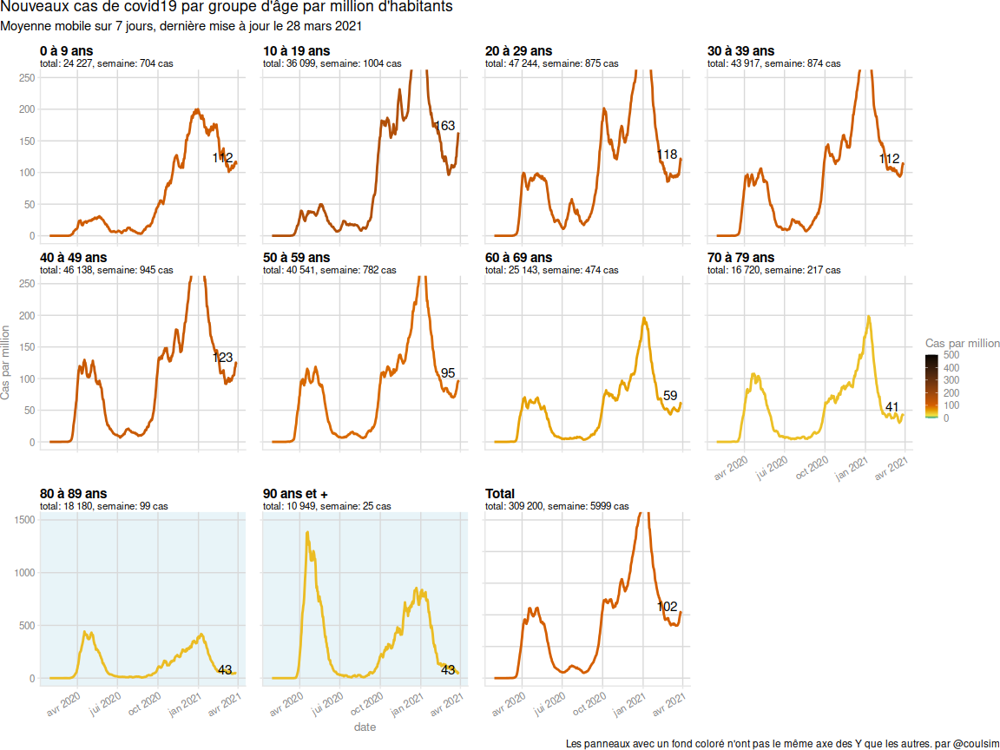
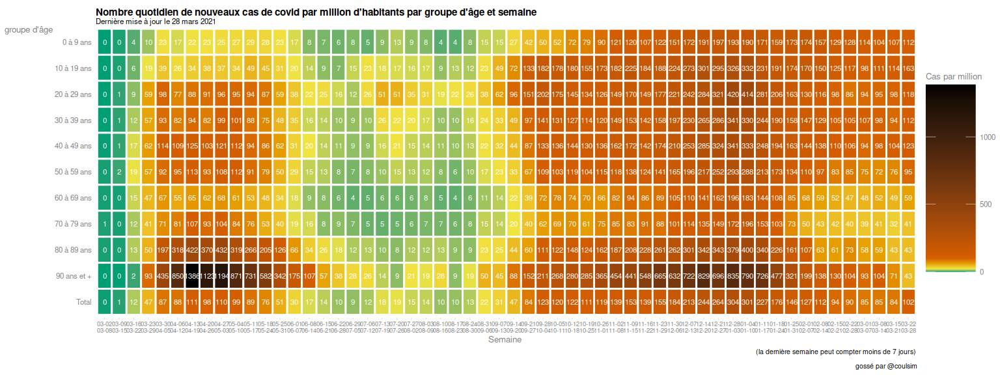
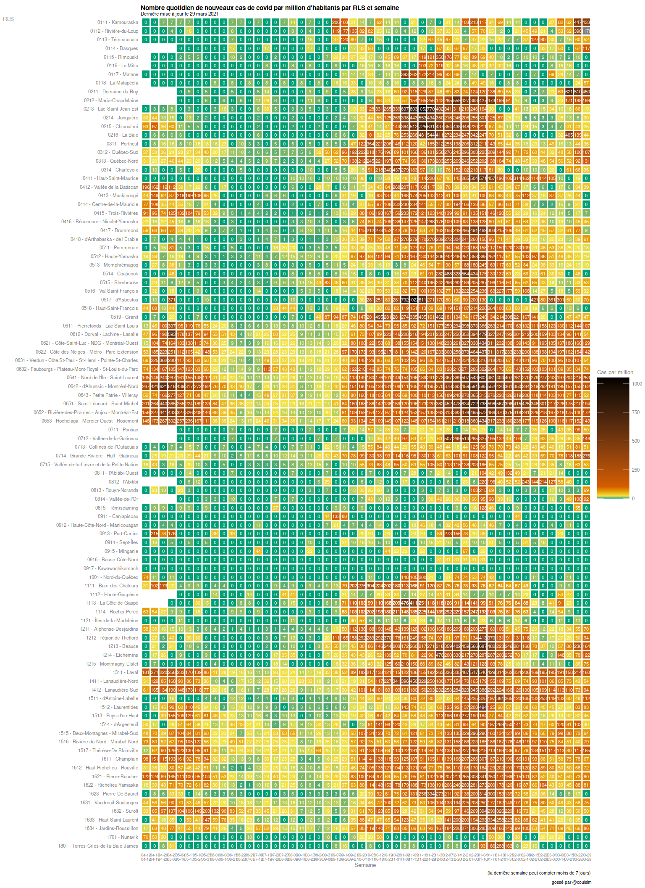

<!-- README.md is generated from README.Rmd. Please edit that file -->

# covidtwitterbot

<!-- badges: start -->

<!-- badges: end -->

The goal of covidtwitterbot is to generate the figures and maps that are
posted on my twitter bot, @covid\_coulsim.

## Installation

You can install the development version from
[GitHub](https://github.com/) with:

``` r
# install.packages("devtools")
devtools::install_github("SimonCoulombe/covidtwitterbot")
```

## Example

### Tables

Here are the tables you can fetch and the graphics you can generate..
They are generated from the most up-to-date data.

``` r
library(covidtwitterbot)
```

The `load_inspq_covid19_hist()` function fetches historical data for
Quebec by age, health region and gender. This includes the numbers of
cases (“cas\_*"), of deaths ("dec\_*”) of hospitalizations (“hos\_*")
and .. something else ("psi\_*”).

``` r
load_inspq_covid19_hist() %>% tail(20)
#> # A tibble: 20 x 54
#>    Date  Regroupement Croisement Nom   cas_cum_lab_n cas_cum_epi_n cas_cum_tot_n
#>    <chr> <chr>        <chr>      <chr>         <dbl>         <dbl>         <dbl>
#>  1 2020… Groupe de r… REG02      Cein…         22073          1699         23772
#>  2 2020… Groupe de r… REG03      Autr…         43293          2180         45473
#>  3 2020… Groupe de r… REG00      Inco…             3             0             3
#>  4 2020… Groupe de r… REG98      Hors…            75             2            77
#>  5 2020… Groupe d'âge 0_9        0-9 …          5197          1395          6592
#>  6 2020… Groupe d'âge 10_19      10-1…         11971          1222         13193
#>  7 2020… Groupe d'âge 20_29      20-2…         18797          1227         20024
#>  8 2020… Groupe d'âge 30_39      30-3…         16388           961         17349
#>  9 2020… Groupe d'âge 40_49      40-4…         17807           986         18793
#> 10 2020… Groupe d'âge 50_59      50-5…         16028           867         16895
#> 11 2020… Groupe d'âge 60_69      60-6…         10053           462         10515
#> 12 2020… Groupe d'âge 70_79      70-7…          7635           192          7827
#> 13 2020… Groupe d'âge 80_89      80-8…          9417           252          9669
#> 14 2020… Groupe d'âge 90_        90 a…          6085           215          6300
#> 15 2020… Groupe d'âge INC        Inco…            38            35            73
#> 16 2020… Groupe d'âge TOT        Total        119416          7814        127230
#> 17 2020… Sexe         MASC       Masc…         53474          3941         57415
#> 18 2020… Sexe         FEM        Fémi…         65833          3872         69705
#> 19 2020… Sexe         INC        Inco…           109             1           110
#> 20 2020… Sexe         TOT        Total        119416          7814        127230
#> # … with 47 more variables: cas_cum_tot_t <chr>, cas_quo_tot_t <chr>,
#> #   cas_quo_lab_n <dbl>, cas_quo_epi_n <dbl>, cas_quo_tot_n <dbl>,
#> #   act_cum_tot_n <dbl>, act_cum_tot_t <chr>, cas_quo_tot_m <dbl>,
#> #   cas_quo_tot_tm <dbl>, ret_cum_tot_n <dbl>, ret_quo_tot_n <dbl>,
#> #   dec_cum_tot_n <dbl>, dec_cum_tot_t <chr>, dec_quo_tot_t <chr>,
#> #   dec_cum_chs_n <dbl>, dec_cum_rpa_n <dbl>, dec_cum_dom_n <dbl>,
#> #   dec_cum_aut_n <dbl>, dec_quo_tot_n <dbl>, dec_quo_chs_n <dbl>,
#> #   dec_quo_rpa_n <dbl>, dec_quo_dom_n <dbl>, dec_quo_aut_n <dbl>,
#> #   dec_quo_tot_m <dbl>, dec_quo_tot_tm <dbl>, hos_cum_reg_n <chr>,
#> #   hos_cum_si_n <chr>, hos_cum_tot_n <chr>, hos_cum_tot_t <chr>,
#> #   hos_quo_tot_t <chr>, hos_quo_reg_n <chr>, hos_quo_si_n <chr>,
#> #   hos_quo_tot_n <chr>, hos_quo_tot_m <chr>, psi_cum_tes_n <dbl>,
#> #   psi_cum_pos_n <dbl>, psi_cum_inf_n <dbl>, psi_quo_pos_n <dbl>,
#> #   psi_quo_inf_n <dbl>, psi_quo_tes_n <dbl>, psi_quo_pos_t <chr>, date <date>,
#> #   type <chr>, groupe <chr>, cas_totaux_cumul <dbl>,
#> #   cas_totaux_quotidien <dbl>, deces_totaux_quotidien <dbl>
```

The load\_inspq\_manual\_data() function returns the historical number
of hospitalisation (hospits\_ancien and hospits), intensive care (si)
and number of tests (volumetrie) for the province

``` r
load_inspq_manual_data() %>% tail(20)
#> # A tibble: 20 x 5
#>    date       hospits hospits_ancien    si volumetrie
#>    <date>       <dbl>          <dbl> <dbl>      <dbl>
#>  1 2020-10-29     434             NA    81      27993
#>  2 2020-10-30     421             NA    82      25279
#>  3 2020-10-31     412             NA    84      22487
#>  4 2020-11-01     418             NA    81      17057
#>  5 2020-11-02     441             NA    85      19597
#>  6 2020-11-03     458             NA    81      25563
#>  7 2020-11-04     456             NA    82      28925
#>  8 2020-11-05     462             NA    77      29776
#>  9 2020-11-06     445             NA    78      26951
#> 10 2020-11-07     450             NA    77      21884
#> 11 2020-11-08     464             NA    76      19848
#> 12 2020-11-09     452             NA    82      21851
#> 13 2020-11-10     489             NA    84      28078
#> 14 2020-11-11     497             NA    86      28916
#> 15 2020-11-12     498             NA    85      29846
#> 16 2020-11-13     501             NA    82      29512
#> 17 2020-11-14     498             NA    89      26864
#> 18 2020-11-15     504             NA    87      21685
#> 19 2020-11-16     538             NA   100      21392
#> 20 2020-11-17     552             NA   100         NA
```

The get\_clean\_rls\_data() function returns the historical number of
cases at the RLS (région locale de service). There are no historical
files at the RLS level on the INSPQ website. This function depends on a
bunch of historical data that I collected, plus a daily archive
repository maintained by Jean-Paul R Soucy.

This function takes a while because it has to download a few hundred of
CSVs before aggregating them.

``` r
rls_data <- get_clean_rls_data() 

rls_data %>% tail(20)
#> # A tibble: 20 x 20
#>    RSS   RLS   date_report cumulative_cases source fix_cummin cases
#>    <chr> <chr> <date>                 <dbl> <chr>       <dbl> <dbl>
#>  1 14 -… 1411… 2020-11-18              4655 curre…       4655    65
#>  2 14 -… 1412… 2020-11-18              5116 curre…       5116    51
#>  3 15 -… 1511… 2020-11-18               123 curre…        123     4
#>  4 15 -… 1512… 2020-11-18               307 curre…        307     0
#>  5 15 -… 1513… 2020-11-18               402 curre…        402     5
#>  6 15 -… 1514… 2020-11-18               257 curre…        257     0
#>  7 15 -… 1515… 2020-11-18              1607 curre…       1607     7
#>  8 15 -… 1516… 2020-11-18              2115 curre…       2115     8
#>  9 15 -… 1517… 2020-11-18              2611 curre…       2611    28
#> 10 16 -… 1611… 2020-11-18              3613 curre…       3613    36
#> 11 16 -… 1612… 2020-11-18              2102 curre…       2102    22
#> 12 16 -… 1621… 2020-11-18              3923 curre…       3923    20
#> 13 16 -… 1622… 2020-11-18              2964 curre…       2964    26
#> 14 16 -… 1623… 2020-11-18               266 curre…        266     8
#> 15 16 -… 1631… 2020-11-18              1445 curre…       1445     6
#> 16 16 -… 1632… 2020-11-18               934 curre…        934     0
#> 17 16 -… 1633… 2020-11-18               209 curre…        209     0
#> 18 16 -… 1634… 2020-11-18              2721 curre…       2721    14
#> 19 17 -… 1701… 2020-11-18                30 curre…         30     1
#> 20 18 -… 1801… 2020-11-18                16 curre…         16     0
#> # … with 13 more variables: shortname_rls <chr>, Population <dbl>,
#> #   cases_per_100k <dbl>, cases_last_7_days <dbl>,
#> #   previous_cases_last_7_days <dbl>, cases_last_7_days_per_100k <dbl>,
#> #   RLS_code <chr>, cases_per_1M <dbl>, last_cases_per_1M <dbl>,
#> #   previous_cases_per_1M <dbl>, color_per_pop <fct>, pop <dbl>,
#> #   RLS_petit_nom <chr>
```

We estimate number of cases at the school board (centre de service
scolaire) level based on the more fine-grained RLS data. It is not
perfect (sometime a RLS stradles 2 CSS so we have to split the cases
proportionally to the population in the intersections), but it’s a good
start. The get\_css\_last\_week() functions runs faster if you provide
it with the `rls_data` object we created when we downloaded the RLS
data. If this is not provided then the RLS data has to be downloaded
again.

``` r
css_last_week  <- get_css_last_week(rls_data)
```

### Figures and maps

``` r
graph_deces_hospit_tests()
```


``` r
graph_quebec_cas_par_region()
```


``` r
graph_quebec_cas_par_age()
```


``` r
graph_quebec_cas_par_age_heatmap()
```


graph\_quebec\_cas\_par\_rls\_heatmap() generates the heatmap showing
the history of cases per capita. It runs faster if you provide it with
an already-downloaded “rls\_data” dataframe provided by
get\_clean\_rls\_data()

``` r
graph_quebec_cas_par_rls_heatmap(rls_data)
```


`carte_rls()` crée une carte montrant le nombre moyen de cas par jour
par million d’habitant durant les 7 derniers jours

``` r
carte_rls(rls_data)
```



``` r
carte_rls_zoom_montreal(rls_data)
```



We can also generate some charts from the estimated cases by CSS for the
previous week:

``` r
carte_css(css_last_week)
```


``` r
graph_css_bars(css_last_week)
```


### Shapefiles

Some shapefiles are included with this package. They are created using
script located in the `data-raw` folder in the repo.

`shp_water` is a (simplified) shapefile showing all coastal water in a
single multipolygon. It is used when I want to remove water from other
shapefiles (such as RLS or CSS). It is derived from statistics canada’s
“Coastal waters (polygons)” for Census 2011 at
<https://www12.statcan.gc.ca/census-recensement/2011/geo/bound-limit/bound-limit-2011-eng.cfm>
. I tried the 2016 version, but some polygons are broken.

``` r
plot(shp_water[,1])
```


The shapefile `shp_rls` shows all the RLS in Quebec after removing
water. It is derived from “Limites territoriales des réseaux locaux de
santé (RLS) en 2020”
(<https://www.donneesquebec.ca/recherche/fr/dataset/limites-territoriales/resource/a73c9996-010d-41ac-a4ba-4def322d55bf>),from
which I removed the coastal waters.

``` r
plot(shp_rls[,1])
```

 The
shapefile `shp_css` shows all the CSS (centres de services scolaires) in
Quebec after removing water. It is derived from “Centres de services
scolaires francophones (SDA)” shapefile
<https://www.donneesquebec.ca/recherche/dataset/territoires-des-commissions-scolaires-du-quebec/resource/4cd70cc8-2663-4f10-bfce-bb46f62a77da,from>
which I removed the coastal waters.

``` r
plot(shp_css[,1])
```


### Palettes

palette\_OkabeIto is a color palette that was built by higher beings to
be visible to color-blind people

``` r
palette_OkabeIto
#>        orange       skyblue   bluishgreen        yellow          blue 
#>     "#E69F00"     "#56B4E9"     "#009E73"     "#F0E442"     "#0072B2" 
#>    vermillion reddishpurple          gray 
#>     "#D55E00"     "#CC79A7"     "#999999"
```
